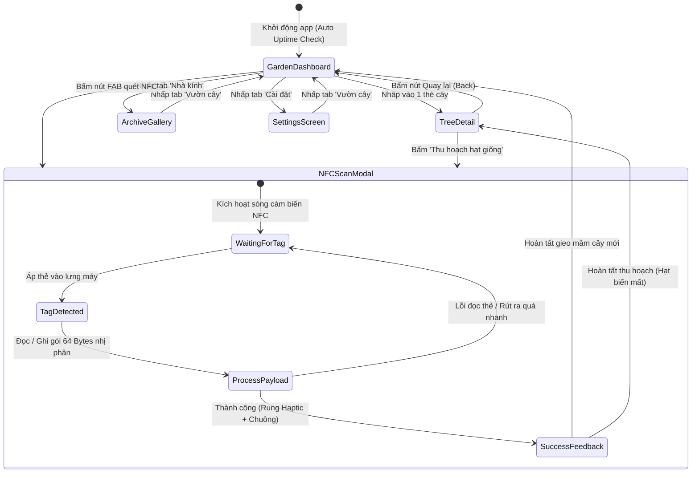
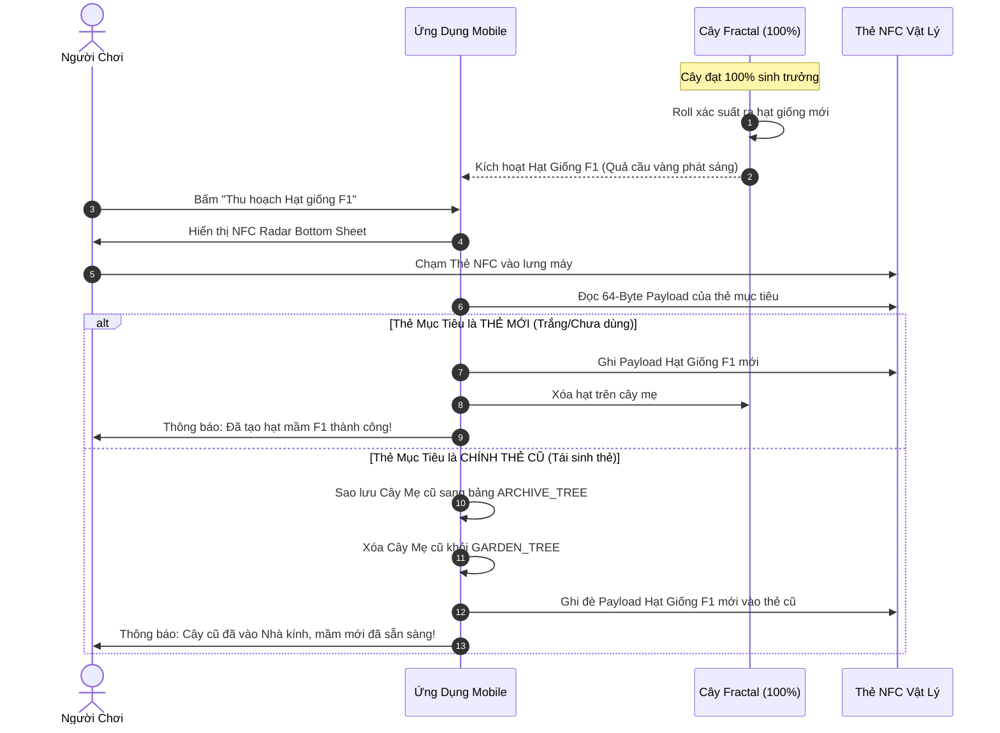

# 04. Luồng Trải Nghiệm Người Dùng (User Flows & State Transitions)

Tài liệu này mô hình hóa toàn bộ hành trình người dùng (User Journeys) và các máy trạng thái (State Machines) trong ứng dụng.

---

## 1. Bản Đồ Trạng Thái Điều Hướng Toàn Cục

---

## 2. Các Luồng Chi Tiết Từng Bước

### Luồng 1: Khởi Động & Kiểm Soát Toàn Vẹn Thời Gian (Launch & Anti-Tamper)
1. Người chơi mở ứng dụng.
2. Hệ thống gọi `TimeKeeperService.validateSystemTime()`:
   - Lấy `wallClockTime` hiện tại và `deviceUptime` từ phần cứng.
   - So sánh với `last_active_at` và `last_uptime` lưu trong MMKV.
3. **Phân nhánh kiểm tra:**
   - **Hợp lệ:** Tự động tính toán lại tiến trình % của tất cả các cây theo thời gian trôi qua $\to$ Mở màn hình Garden Dashboard.
   - **Bị vặn lùi giờ (Rewind):** Hiển thị Modal cảnh báo lệch giờ, tạm khóa mọc cây cho đến khi giờ máy được chỉnh đúng.
   - **Bị vặn tiến giờ bất thường (Forward Skip mà uptime không đổi):** Chỉ tính tiến trình theo mức tăng của phần cứng `deviceUptime`.

### Luồng 2: Quẹt Thẻ Gieo Mầm Cây Mới (First NFC Planting Flow)
1. Người chơi chạm thẻ NFC chứa mầm cây vào lưng điện thoại (hoặc bấm nút FAB NFC trên màn hình rồi chạm thẻ).
2. Hệ thống đọc gói nhị phân 64 Bytes:
   - Kiểm tra `magic == 0x5452` và `CRC16`.
   - Kiểm tra bit trạng thái `flags.isPlanted`:
     - Nếu `isPlanted == 0` (Hạt chưa trồng):
       - Ghi timestamp `planted_at = Date.now()` và set `isPlanted = 1` ngược vào thẻ NFC.
       - Lưu bản ghi mới vào bảng `GARDEN_TREE` trên máy.
       - Điện thoại rung nhẹ (`Haptic Success`) và hiển thị hiệu ứng mầm non đội đất nảy nở.
     - Nếu `isPlanted == 1` (Cây đã trồng):
       - Đồng bộ tiến trình giữa thẻ và máy, mở ngay màn hình Chi Tiết Cây.

### Luồng 3: Cây 100% Trưởng Thành, Kết Hạt & Thu Hoạch Thẻ

