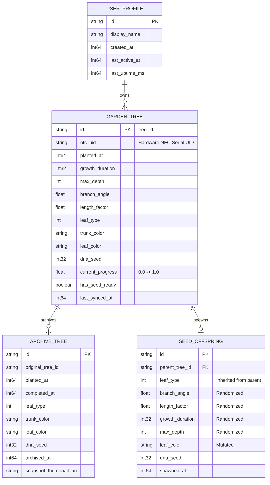

# 06. Cơ Sở Dữ Liệu & Mô Hình Thực Thể (Database Schema & Storage)

Ứng dụng sử dụng kiến trúc lưu trữ 2 lớp siêu tốc:
1. **SQLite (`@op-engineering/op-sqlite`)**: Lưu trữ dữ liệu quan hệ có cấu trúc (Cây trong vườn, Nhà kính danh dự).
2. **MMKV (`react-native-mmkv`)**: Lưu trữ Key-Value truy xuất nano-giây (Heartbeat, Hardware Uptime, Configs).

---

## 1. Sơ Đồ Thực Thể Quan Hệ (Entity Relationship Diagram - ERD)



---

## 2. Bảng Đặc Tả SQLite Schema (DDL)

### 2.1. Bảng `garden_trees` (Cây Đang Sống Trong Khu Vườn)
```sql
CREATE TABLE IF NOT EXISTS garden_trees (
    id TEXT PRIMARY KEY,                       -- UUID của cây
    nfc_uid TEXT NOT NULL,                     -- Serial phần cứng của thẻ NFC
    generation INTEGER NOT NULL DEFAULT 0,     -- Thế hệ: 0 = Cây gốc P, 1 = F1, 2 = F2...
    parent_tree_id TEXT DEFAULT NULL,          -- ID của cây mẹ (NULL nếu là P)
    planted_at INTEGER NOT NULL,               -- Epoch ms thời điểm bắt đầu trồng
    growth_duration INTEGER NOT NULL,          -- Tổng thời gian lớn (giây)
    max_depth INTEGER NOT NULL DEFAULT 9,      -- Độ sâu đệ quy
    branch_angle REAL NOT NULL,                -- Góc rẽ nhánh (độ)
    length_factor REAL NOT NULL,               -- Tỉ lệ suy giảm độ dài cành
    leaf_type INTEGER NOT NULL,                -- 0..13 (Pointed, Willow, Sakura...)
    trunk_color TEXT NOT NULL,                 -- Mã hex/theme màu thân cây
    leaf_color TEXT NOT NULL,                  -- Mã hex/palette màu lá
    dna_seed INTEGER NOT NULL,                 -- Hạt số ngẫu nhiên PRNG
    current_progress REAL NOT NULL DEFAULT 0,  -- Tiến trình mọc (0.0 đến 1.0)
    has_seed_ready INTEGER NOT NULL DEFAULT 0, -- 1: Đã kết hạt mới chờ thu hoạch
    last_synced_at INTEGER NOT NULL            -- Timestamp đồng bộ thẻ gần nhất
);
```

### 2.2. Bảng `archive_trees` (Nhà Kính Vinh Danh Cổ Thụ)
```sql
CREATE TABLE IF NOT EXISTS archive_trees (
    id TEXT PRIMARY KEY,                       -- UUID bản ghi lưu trữ
    original_tree_id TEXT NOT NULL,            -- ID cây cũ trước khi bị ghi đè thẻ
    generation INTEGER NOT NULL DEFAULT 0,     -- Thế hệ của cây (0=P, 1=F1...)
    parent_tree_id TEXT DEFAULT NULL,          -- ID cây mẹ
    planted_at INTEGER NOT NULL,               -- Ngày bắt đầu trồng
    completed_at INTEGER NOT NULL,             -- Ngày cây đạt 100%
    leaf_type INTEGER NOT NULL,                -- Loài lá
    trunk_color TEXT NOT NULL,
    leaf_color TEXT NOT NULL,
    dna_seed INTEGER NOT NULL,
    archived_at INTEGER NOT NULL,              -- Thời điểm chuyển vào Nhà kính
    snapshot_thumbnail_uri TEXT                -- Đường dẫn ảnh chụp thu nhỏ của cây
);
```

### 2.3. Bảng `compendium_entries` (Bách Thảo Thư Viện)
```sql
CREATE TABLE IF NOT EXISTS compendium_entries (
    id INTEGER PRIMARY KEY AUTOINCREMENT,
    trait_type TEXT NOT NULL,                  -- 'leaf_type' | 'palette' | 'trunk'
    trait_id TEXT NOT NULL,                    -- Mã định danh đặc tính (e.g. '0', 'sakura', 'emerald')
    first_discovered_at INTEGER NOT NULL,      -- Timestamp epoch ms lần đầu tiên sở hữu
    times_encountered INTEGER DEFAULT 1,       -- Số lần cây mang đặc tính này từng xuất hiện
    is_viewed INTEGER DEFAULT 0,               -- 0: Mới mở khóa chưa xem (bật chấm đỏ), 1: Đã xem
    UNIQUE(trait_type, trait_id)
);

CREATE INDEX IF NOT EXISTS idx_compendium_lookup ON compendium_entries (trait_type, trait_id);
```

---

## 3. Bảng Phân Bổ MMKV Key-Value Storage

| MMKV Key | Kiểu dữ liệu | Mục đích sử dụng |
| :--- | :--- | :--- |
| `timekeeper.last_active_timestamp` | `int64` | Timestamp ghi nhận gần nhất khi app chạy |
| `timekeeper.last_device_uptime` | `int64` | Uptime phần cứng máy tại lần chạy gần nhất |
| `timekeeper.heartbeat_tick` | `int64` | Vòng lặp nhịp tim chống vặn ngược giờ máy |
| `settings.sound_enabled` | `boolean` | Bật / tắt âm thanh chuông gió thư giãn |
| `settings.haptic_enabled` | `boolean` | Bật / tắt rung phản hồi khi quẹt thẻ NFC |
| `app_effects_enabled` | `boolean` | Bật / tắt hiệu ứng đồ họa đặc biệt (mặc định: true) |
| `app_target_fps` | `number` | Tốc độ khung hình mục tiêu: 24, 30, 45, 60 FPS (mặc định: 60) |

---

## 4. Quy Tắc Vòng Đời & Phân Định GardenTree vs ArchiveTree

Một cây **KHÔNG BAO GIỜ** nằm ở cả 2 màn hình cùng một lúc:
1. **GardenTree:** Cây đang gắn với một thẻ NFC vật lý ngoài đời. Cây là **thực thể sống (Live)**: có thể sinh hạt, lớn dần theo thời gian, có thể chạm thẻ vật lý để đồng bộ.
2. **ArchiveTree:** Khi thẻ NFC cũ bị đem đi ghi đè mầm cây mới, cây cũ được chuyển sang `archive_trees` và xóa khỏi `garden_trees`. Cây trở thành **hiện vật trưng bày (Read-Only)** để người chơi ngắm lại thành quả.
