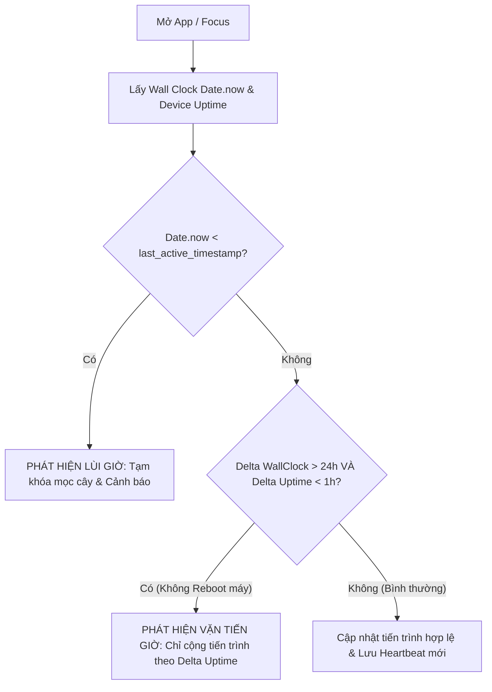

# 10. Môi Trường & Chính Sách Bảo Mật (Env & Security)

Dự án hoạt động theo nguyên tắc **100% Offline-First**, do đó các khía cạnh bảo mật tập trung vào: **Toàn vẹn dữ liệu phần cứng thẻ NFC**, **Chống gian lận giờ máy (Clock Spoofing)** và **Bảo vệ quyền riêng tư người dùng**.

---

## 1. Biến Môi Trường Mẫu (`.env.example`)

Vì không có backend server, các biến môi trường chủ yếu phục vụ cấu hình tham số game và cờ kiểm thử (Debug Flags):

```bash
# Debug & Simulation Flags
DEBUG_NFC_SIMULATION=false        # Bật chế độ giả lập NFC trên Emulator (không cần máy thật)
DEBUG_ACCELERATED_GROWTH=false    # Tăng tốc độ mọc cây x60 lần để test kiểm thử nhanh
DEBUG_FORCE_SEED_DROP=false       # Ép cây 100% luôn ra hạt giống ngay lập tức

# Game Balance Constants
SEED_DROP_CHANCE_PER_HOUR=0.15    # Tỉ lệ ra hạt mỗi giờ khi cây đạt 100% (15%)
MAX_ACTIVE_SEEDS_PER_TREE=1       # Số hạt tối đa trên 1 cây trưởng thành
NFC_PROTOCOL_VERSION=1            # Phiên bản giao thức nhị phân thẻ NFC
```

---

## 2. Chính Sách Chống Gian Lận Giờ Máy (Anti-Time-Tampering Policy)

Vì game tính toán % lớn của cây dựa vào thời gian thực:
$$\text{Progress} = \min\left(1.0, \frac{\text{CurrentTime} - \text{PlantedAt}}{\text{Duration}}\right)$$

Người chơi có thể cố tình vào Cài đặt hệ thống để chỉnh lùi hoặc tiến ngày giờ điện thoại nhằm "hack" game. Hệ thống thiết lập hàng rào 3 lớp bảo vệ:



1. **Phát hiện vặn lùi giờ (Backwards Clock Spoofing):**
   - Nếu `Date.now() < last_active_timestamp` $\to$ Cảnh báo người chơi và đóng băng thời gian mọc cho đến khi giờ máy trở về bình thường.
2. **Phát hiện nhảy cóc giờ (Forward Time Skipping):**
   - So sánh giữa độ tăng giờ mặt trời ($\Delta_{\text{wall}}$) và độ tăng đồng hồ phần cứng ($\Delta_{\text{uptime}}$). Nếu máy không bị tắt nguồn mà giờ mặt trời nhảy vọt nhiều ngày trong khi phần cứng chỉ chạy thêm vài phút $\to$ Chặn việc ăn gian và chỉ ghi nhận thời gian thực tế của phần cứng.

---

## 3. Chính Sách Toàn Vẹn & An Toàn Dữ Liệu Thẻ NFC

1. **Kiểm tra Magic Bytes:** Mọi thẻ trước khi đọc phải khớp đúng 2 byte đầu `0x5452` ('TR'). Thẻ ngân hàng, thẻ căn cước hoặc thẻ NFC lạ sẽ bị từ chối ngay lập tức mà không ghi đè dữ liệu bừa bãi.
2. **Kiểm tra Checksum CRC-16-CCITT:** 2 byte cuối cùng (byte 62-63) là mã băm CRC16 của 62 bytes phía trước. Nếu người chơi rút thẻ quá nhanh khi đang ghi, mã CRC sẽ không khớp $\to$ Hệ thống nhận diện giao dịch hỏng và khôi phục trạng thái an toàn.
3. **Quyền riêng tư tuyệt đối:** Dữ liệu thẻ không chứa bất kỳ thông tin cá nhân nào (chỉ chứa các con số góc cành, loại lá và timestamp), không thu thập định danh thiết bị ra ngoài Internet.
