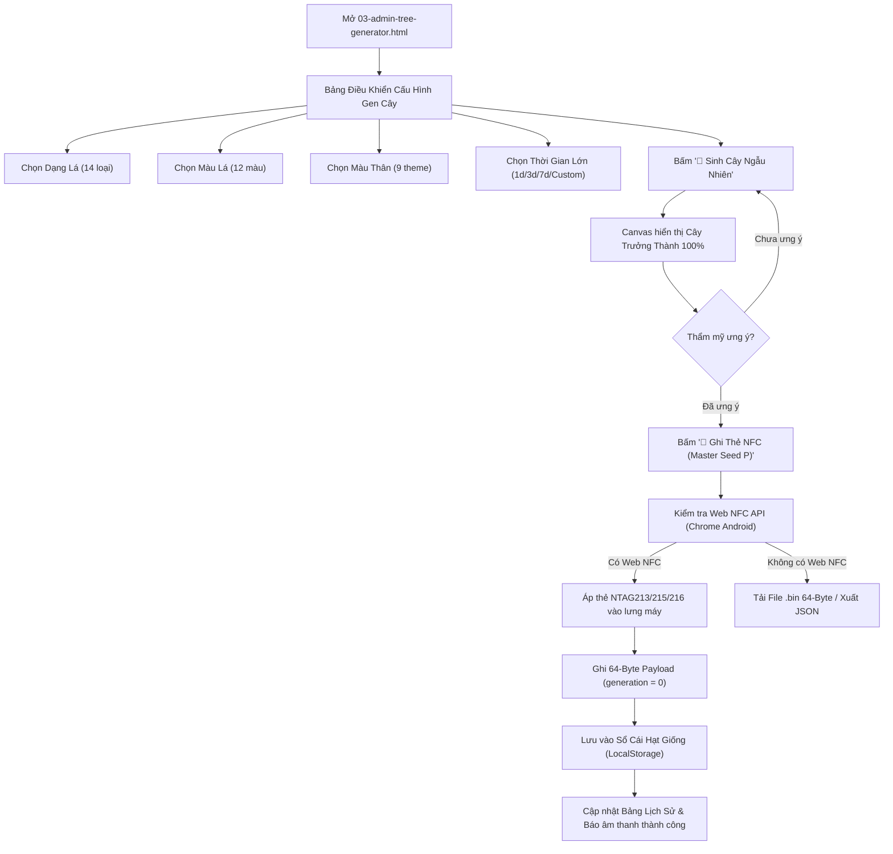

# Feature Specification: Admin Parent Tree Generator & NFC Master Writer
**Tên tính năng:** Trình Tạo Cây Gốc P & Ghi Thẻ NFC Quản Trị (Admin Parent Tree Generator & NFC Master Writer)  
**Mã tài liệu:** `docs/features/admin-parent-tree-generator.md`  
**Trạng thái:** Triển khai Giai đoạn 1 (Nội bộ / Standalone Web NFC Tool) & Chuẩn bị Giai đoạn 2 (Google Auth + Cloud BaaS)

---

## 1. Mục Tiêu Tính Năng & Bối Cảnh Nghiệp Vụ

### A. Vấn đề
- Trong game Fractal Tree NFC, mọi cây sinh ra đều cần có nguồn gốc xuất xứ. Trước đây chưa có công cụ để người quản trị hoặc nhà sản xuất có thể trồng thử nghiệm các tổ hợp gen cành lá, tinh chỉnh độ thẩm mỹ của cây trưởng thành và "đúc" (mint/write) cây đó vào thẻ vật lý dưới dạng **Hạt Giống Cây Gốc P (Parent Generation 0)**.
- Chưa có cơ chế phân tầng thế hệ để phân biệt cây gốc $P$ do Admin phát hành với các thế hệ hạt con cháu ($F_1, F_2, \dots, F_n$) do người chơi thu hoạch trong game.

### B. Giải pháp
- Xây dựng công cụ Web Admin độc lập **`ui-ux/03-admin-tree-generator.html`** cho phép:
  1. Chọn thủ công hoặc ngẫu nhiên Dạng Lá (14 loại), Màu Tán Lá (12 palette), Màu Vỏ Thân (9 theme).
  2. Tự động sinh ngẫu nhiên các thông số hình học đệ quy, render trực quan cây trưởng thành 100% để Admin kiểm duyệt thẩm mỹ.
  3. Cấu hình thời gian sinh trưởng theo độ hiếm (Common: 1 ngày, Rare: 3 ngày, Legendary: 7 ngày) hoặc tùy chỉnh thủ công.
  4. Ghi trực tiếp khối nhị phân 64 Bytes vào chip nhớ thẻ NFC (NTAG213 / NTAG215 / NTAG216) qua **Web NFC API** với đánh dấu thế hệ **$P$ (`generation = 0`)** và `parent_tree_id = 0x00000000`.
  5. Sổ cái lưu vết cục bộ (`localStorage`) cho phép tra cứu, tìm kiếm và xuất file JSON/CSV phục vụ quản lý kho thẻ nội bộ.
  6. Kiến trúc sẵn sàng kết nối Google Sign-In và Cloud BaaS (Firebase / Supabase) cho giai đoạn sau.

---

## 2. Đặc Tả Nhị Phân 64 Bytes Thẻ NFC (NFC Binary Protocol Update)

Cập nhật chuẩn 64 Bytes trong [`docs/05-architecture.md`](file:///Users/namtran/Local%20Apps/TreeNFCGame/docs/05-architecture.md) tại vùng `reserved`:

| Offset (Bytes) | Tên trường | Kiểu dữ liệu | Mô tả |
| :--- | :--- | :--- | :--- |
| **0 - 1** | `magic` | `uint16_be` | `0x5452` ('TR') |
| **2** | `version` | `uint8` | `0x01` |
| **3** | `flags` | `uint8` | `0x00` = Hạt giống chưa gieo (`planted_at = 0`) |
| **4 - 7** | `tree_id` | `uint32_be` | ID duy nhất của cây/hạt giống |
| **8 - 15** | `planted_at` | `uint64_be` | `0` (chưa gieo) |
| **16 - 19** | `growth_duration`| `uint32_be` | Thời gian sinh trưởng tính bằng giây (86.400s / 259.200s / 604.800s / custom) |
| **20** | `leaf_type` | `uint8` | ID dạng lá (0 - 13) |
| **21** | `branch_angle` | `uint8` | Góc phân nhánh |
| **22** | `length_factor` | `uint8` | Tỉ lệ suy giảm độ dài cành |
| **23** | `max_depth` | `uint8` | Độ sâu đệ quy |
| **24 - 25** | `trunk_color_rgb565` | `uint16_be` | Mã màu thân |
| **26 - 27** | `leaf_color_rgb565` | `uint16_be` | Mã màu lá |
| **28 - 31** | `dna_seed` | `uint32_be` | PRNG Seed tái tạo hình học |
| **32** | **`generation`** | **`uint8`** | **Thế hệ cây:** `0` = Cây gốc P, `1` = F1, `2` = F2,... |
| **33 - 36** | **`parent_tree_id`**| **`uint32_be`** | **ID cây mẹ sinh ra:** `0x00000000` đối với cây P; bằng `tree_id` của cây mẹ đối với F1... |
| **37 - 47** | `reserved` | `bytes[11]` | 11 bytes dự phòng còn lại |
| **48 - 61** | `reserved_extra` | `bytes[14]` | 14 bytes dự phòng bổ sung |
| **62 - 63** | `crc16` | `uint16_be` | Checksum CRC-16-CCITT |

---

## 3. Quy Chuẩn Thời Gian Sinh Trưởng Theo Độ Hiếm (Growth Duration Rules)

Nếu Admin không cấu hình thời gian riêng, hệ thống tự động gán thời gian theo bảng độ hiếm:
- **🌱 Common (Phổ Biến):** `1 ngày` (86.400 giây).
- **💎 Rare (Hiếm):** `3 ngày` (259.200 giây).
- **👑 Legendary (Huyền Thoại):** `7 ngày` (604.800 giây).
- **⏱️ Tùy chọn Custom:** Cho phép Admin nhập số phút/giờ/ngày linh hoạt để tạo các thẻ sự kiện hoặc thẻ test nhanh (ví dụ: 5 phút, 1 giờ).

---

## 4. Luồng Trải Nghiệm Người Dùng (User Flow)

---

## 5. Tác Động Hệ Thống (Impact Analysis)

### A. Mobile App (React Native)
1. **NFC Parser & Packer (`src/services/nfc/`):**
   - Giải mã `generation` (byte 32) và `parent_tree_id` (bytes 33-36).
   - Nếu `generation === 0`: Hiển thị huy hiệu **"👑 Hạt Giống Cây Gốc P"** trên thẻ thông tin cây và trong Nhà Kính.
2. **SQLite Database Schema (`docs/06-database-schema.md`):**
   - Bảng `trees`: Thêm 2 cột `generation INTEGER DEFAULT 0` và `parent_tree_id INTEGER DEFAULT 0`.
3. **Cơ chế Lai Tạo & Kết Hạt F1 (`src/services/breeding/`):**
   - Khi cây mẹ đạt 100% và sinh hạt mới: Hạt mới tự động nhận `generation = tree.generation + 1` và `parent_tree_id = tree.tree_id`. Cây gốc P sinh ra hạt F1; cây F1 sinh ra hạt F2.

### B. Web Admin Portal
- File mới: `ui-ux/03-admin-tree-generator.html`.
- Không cần login ở giai đoạn nội bộ (vận hành 100% offline trên trình duyệt hoặc host tĩnh).
- Sẵn sàng cấu trúc data để đẩy lên Firebase/Supabase khi chuyển sang giai đoạn Cloud BaaS.
