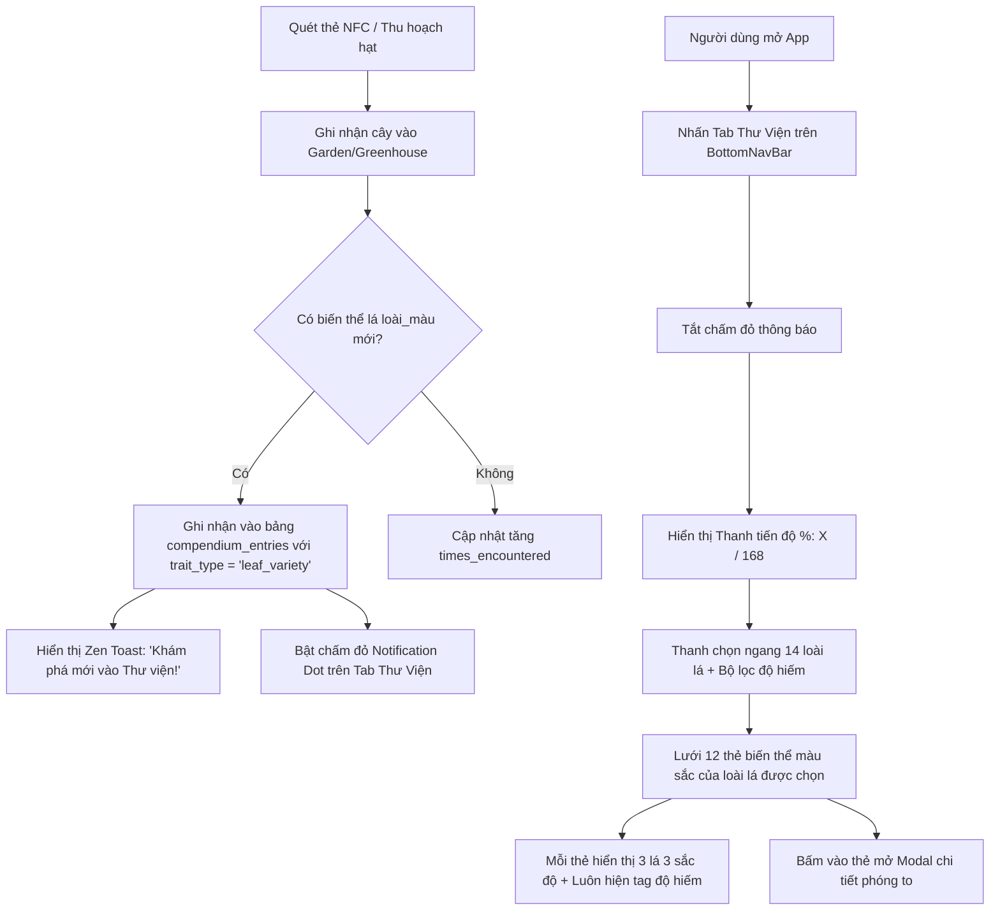

# Feature Spec: Thư Viện Bách Thảo (Botanical Compendium)
**Mã phân hệ:** `F-COMPENDIUM`  
**Trạng thái:** Approved / In Implementation  
**Ngày phê duyệt:** 2026-09-13  

---

## 1. Mô Tả Tổng Quan & Mục Tiêu

Tính năng **Thư Viện Bách Thảo (Botanical Compendium)** là một bách khoa toàn thư thực vật số dạng sổ tay sưu tập (Pokédex Style) hoạt động 100% Offline-First. 

#### Mục tiêu:
1. Giúp người chơi theo dõi tiến độ sưu tầm toàn bộ các biến dị di truyền trong trò chơi:
   - **Tổ chức theo 14 Loài lá cây $\times$ 12 Bảng màu = 168 Biến thể lá (Leaf Varieties):** Mỗi loài lá được chia nhỏ theo 12 bảng màu sắc và gắn độ hiếm tương ứng.
   - **Cơ chế tính độ hiếm của cây:** Được tính **thuần túy theo màu sắc của lá cây** (`getLeafColorRarity`), không lấy max của 3 chỉ số.
   - **Trực quan hóa đa sắc:** Mỗi thẻ biến thể hiển thị chùm **3 lá** với 3 màu sắc sắc độ của bảng màu đó, luôn kèm huy hiệu độ hiếm (Phổ biến, Hiếm, Huyền thoại).
   - Thẻ chưa mở khóa hiển thị tiêu đề **"Chưa khám phá"**.
2. Gia tăng động lực sưu tầm, khuyến khích người chơi liên tục săn tìm thẻ NFC mới, gieo mầm và lai tạo hạt giống F1, F2... để làm đầy bộ sưu tập 168 biến thể.

---

## 2. Luồng Người Dùng (User Flow)



---

## 3. Thiết Kế Giao Diện (UI Layout & Google Stitch Prompt)

### Bố cục màn hình (`CompendiumScreen`):
1. **Header & Progress Card:**
   - Tiêu đề: *Bách Thảo Thư Viện (Botanical Compendium)*.
   - Thẻ tiến độ: Thanh progress bar thanh lịch hiển thị tổng số biến thể đã mở khóa (Ví dụ: `🌱 Đã thu thập: 42 / 168 (25%)`), kèm danh hiệu cấp bậc: *Người Khởi Đầu*, *Nhà Thực Vật Tập Sự*, *Bậc Thầy Lai Tạo*, *Huyền Thoại Bách Thảo*.
2. **Horizontal Leaf Selector (14 Loài lá):**
   - Thanh trượt ngang 14 loài lá, mỗi nút gồm icon lá vector, tên loài lá, số biến thể màu đã mở khóa (`X/12`).
3. **Rarity Filter Pills:**
   - Các nút lọc nhanh: *Tất cả*, *Phổ biến*, *Hiếm*, *Huyền thoại*.
4. **Lưới thẻ 2 cột (Grid Cards - 12 Biến thể):**
   - **Thẻ đã mở khóa (`unlocked`):** 
     - Khung hiển thị chùm **3 lá** xòe quạt mang 3 sắc độ màu của palette.
     - 3 chấm tròn thể hiện 3 sắc thái màu.
     - Tên bảng màu chính xác.
     - Tag độ hiếm (Phổ biến, Hiếm, Huyền thoại) nổi bật.
     - Huy hiệu số lần gặp (`xN`).
   - **Thẻ chưa mở khóa (`locked`):**
     - Khung 3 lá bóng mờ xám thanh lịch.
     - Tiêu đề cố định: `🔒 Chưa khám phá`.
     - Tag độ hiếm **vẫn luôn hiển thị** để người chơi biết mục tiêu săn tìm.
5. **Modal Chi Tiết:**
   - Chùm 3 lá kích thước lớn phóng to sắc nét.
   - Tên biến thể và tên loài lá.
   - 3 chip màu hiển thị mã Hex code.
   - Ngày đầu tiên thu thập (`firstDiscoveredAt`) và số lần gặp (`timesEncountered`).
   - Hướng dẫn cách tìm kiếm nếu biến thể còn khóa.

### Google Stitch Prompt:
```text
A serene, Zen-botanical mobile app screen for "Botanical Compendium / Plant Encyclopedia" (Dark & Light theme supported). 
Top section features an elegant progress card with a smooth leaf-green progress bar showing "Collected: 18 / 35 (51%)" and botanical badge rank. 
Below it is a minimalist 3-pill segmented control: "Leaf Types (14)", "Foliage Colors (12)", "Tree Trunks (9)". 
The main body is a clean 2-column grid of botanical cards. 
Unlocked cards showcase authentic vector leaf silhouettes, gradient foliage swatches, or bark wood textures, with Vietnamese & English names and glowing rarity badges (Common in emerald, Rare in sapphire, Legendary in gold). 
Locked cards display mysterious dark grey silhouettes with a soft question mark icon and subtle rarity hints. 
Tapping an unlocked card smoothly brings up a refined Zen bottom sheet modal with high-res illustration, botanical lore, first discovered date, and encounter count. 
Typography is clean Outfit sans-serif, Japanese wabi-sabi aesthetic, 60fps micro-interactions.
```

---

## 4. Thay Đổi Cơ Sở Dữ Liệu (Database Schema Diff)

### Bảng mới: `compendium_entries`
```sql
CREATE TABLE IF NOT EXISTS compendium_entries (
  id INTEGER PRIMARY KEY AUTOINCREMENT,
  trait_type TEXT NOT NULL,          -- 'leaf_type' | 'palette' | 'trunk'
  trait_id TEXT NOT NULL,            -- e.g. '0', '1', 'sakura', 'emerald'
  first_discovered_at INTEGER NOT NULL, -- Timestamp epoch ms
  times_encountered INTEGER DEFAULT 1,  -- Số lần sở hữu
  is_viewed INTEGER DEFAULT 0,       -- 0: Mới mở khóa chưa xem, 1: Đã xem
  UNIQUE(trait_type, trait_id)
);

CREATE INDEX IF NOT EXISTS idx_compendium_lookup ON compendium_entries (trait_type, trait_id);
```

### Cơ chế Migration Khởi Động (One-time Initial Seed):
Khi app khởi động lần đầu với version mới, hệ thống tự động quét toàn bộ cây hiện có trong bảng `trees` và `archived_trees`, nếu có đặc tính nào chưa có trong `compendium_entries` thì lập tức ghi nhận với `first_discovered_at = tree.plantedAt` và `is_viewed = 1`.

---

## 5. API & Repository Contracts

### `src/storage/repositories/CompendiumRepository.ts`
```typescript
export interface CompendiumEntry {
  id: number;
  traitType: 'leaf_type' | 'palette' | 'trunk';
  traitId: string;
  firstDiscoveredAt: number;
  timesEncountered: number;
  isViewed: boolean;
}

export interface CompendiumStats {
  totalDiscovered: number;
  totalTraits: number; // 14 + 12 + 9 = 35
  percent: number;
  hasUnviewedNew: boolean;
}

export class CompendiumRepository {
  static async getEntriesByType(type: 'leaf_type' | 'palette' | 'trunk'): Promise<Map<string, CompendiumEntry>>;
  static async getAllEntries(): Promise<CompendiumEntry[]>;
  static async getStats(): Promise<CompendiumStats>;
  static async recordTreeTraits(genetics: TreeGenetics, timestamp?: number): Promise<{ isNewDiscovery: boolean; newTraits: string[] }>;
  static async markAllAsViewed(): Promise<void>;
  static async syncFromExistingTrees(): Promise<void>;
}
```

---

## 6. Danh Sách Task Triển Khai (Breakdown Tasks)

1. **Task 1: Database Migration & Repository**
   - Bổ sung bảng `compendium_entries` trong `src/storage/database.ts`.
   - Viết `CompendiumRepository.ts` với đầy đủ các hàm truy vấn, ghi nhận và đồng bộ từ cây cũ.
2. **Task 2: Cập nhật Điều hướng BottomNavBar & App Router**
   - Mở rộng `NavTabId` thêm `'compendium'` trong `BottomNavBar.tsx`.
   - Bổ sung biểu tượng Cuốn Sổ Bách Thảo và chấm phát sáng Notification Dot khi có mục mới.
   - Thêm màn hình `CompendiumScreen` vào `src/App.tsx`.
3. **Task 3: Triển khai Giao diện `CompendiumScreen.tsx`**
   - Header & Progress Bar tổng quan.
   - Segmented Control 3 mục: Loài lá (14), Màu lá (12), Thân cây (9).
   - Grid Card render các loài lá chuẩn vector Skia/SVG, swatch gradient màu tán lá, theme thân cây.
   - BottomSheet xem chi tiết từng đặc tính.
4. **Task 4: Tích hợp Luồng Quét NFC & Thông báo Zen Toast**
   - Gọi `CompendiumRepository.recordTreeTraits` mỗi khi quét thẻ thành công hoặc thu hoạch hạt giống mới.
   - Bắn thông báo Zen Toast nhẹ nhàng khi mở khóa thành công đặc tính mới.
5. **Task 5: Đa ngôn ngữ & Kiểm thử**
   - Cập nhật từ điển `src/i18n/translations.ts` (Việt / Anh).
   - Viết Unit Test cho `CompendiumRepository` và kiểm tra toàn bộ luồng.
